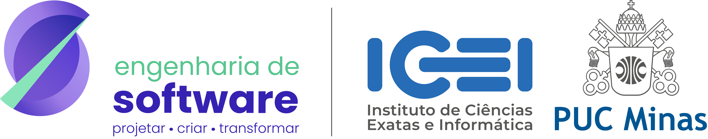

<picture>
  <source
    media="(prefers-color-scheme: dark)"
    srcset="https://raw.githubusercontent.com/Nicolas-De-Almeida/Nicolas-De-Almeida/output/pacman-contribution-graph-dark.svg"
  >
  <source
    media="(prefers-color-scheme: light)"
    srcset="https://raw.githubusercontent.com/Nicolas-De-Almeida/Nicolas-De-Almeida/output/pacman-contribution-graph.svg"
  >
  
</picture>

---

<!-- Título -->

  <a href="#-about-me">🇺🇸 English 🇬🇧</a> |
  <a href="#-sobre-mim">🇧🇷 Português</a>

<!-- Versão em Inglês -->

  <h2>🇺🇸 About Me 🇬🇧</h2>
  <i>
    <b>Hey there</b> :wave:, My name is <code>Nícolas</code>, I'm 21 years old and currently a <code>Software Engineering</code> student at <a href="https://www.pucminas.br/" target="_blank">PUC Minas</a>. I speak Portuguese and English, and I'm currently learning Spanish (it used to be better :)
  </i>

 

<!-- Versão em Português -->

  <h2>🇧🇷 Sobre Mim</h2>
  <i>
    <b>Opa</b> :wave:, Meu nome é <code>Nícolas</code>, tenho 21 anos e atualmente sou estudante de <code>Engenharia de Software</code> na <a href="https://www.pucminas.br/" target="_blank">PUC Minas</a>. Eu falo Português e Inglês, e atualmente estou aprendendo Espanhol (já foi melhor um dia :)
  </i>

---

  <table>
    <tr>
      <td align="center" colspan="4"></td>
    </tr>
    <tr>
      <td>
        
      </td>
      <td>
        
      </td>
      <td>
        
      </td>
      <td>
        
      </td>
    </tr>
    <tr>
      <td align="center" colspan="4"></td>
    </tr>
  </table>

---

 Linguagens e ferramentas:

  <table align="center">
<tr>
  <td align="center">
    
  </td>
  <td align="center">
    
  </td>
  <td align="center">
    
  </td>
  <td align="center">
    
  </td>
  <td align="center">
    
  </td>
</tr>
  </table>

---

  <table>
    <tr>
      <td>
        
      </td>
    </tr>
  </table>

---

  

