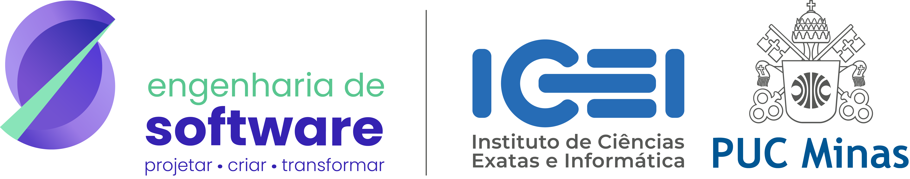

  <picture>
    <source
      media="(prefers-color-scheme: dark)"
      srcset="https://raw.githubusercontent.com/Nicolas-De-Almeida/Nicolas-De-Almeida/output/pacman-contribution-graph-dark.svg">
    <source
      media="(prefers-color-scheme: light)"
      srcset="https://raw.githubusercontent.com/Nicolas-De-Almeida/Nicolas-De-Almeida/output/pacman-contribution-graph.svg">
    
  </picture>

<!-- Título -->

  <a href="#-about-me">🇺🇸 English 🇬🇧</a> |
  <a href="#-sobre-mim">🇧🇷 Português</a>

<!-- Versão em Inglês -->

  <h3>🇺🇸 About Me 🇬🇧</h3>
  <i>
    <b>Hey there</b> :wave:, My name is <code>Nícolas</code>, I'm 21 years old and currently a <code>Software Engineering</code> student at <a href="https://www.pucminas.br/" target="_blank">PUC Minas</a>. I speak Portuguese and English, and I'm currently learning Spanish (it used to be better :)
  </i>

 

<!-- Versão em Português -->

  <h3>🇧🇷 Sobre Mim</h3>
  <i>
    <b>Opa</b> :wave:, Meu nome é <code>Nícolas</code>, tenho 21 anos e atualmente sou estudante de <code>Engenharia de Software</code> na <a href="https://www.pucminas.br/" target="_blank">PUC Minas</a>. Eu falo Português e Inglês, e atualmente estou aprendendo Espanhol (já foi melhor um dia :)
  </i>

  <table>
    <tr>
      <td align="center" width="110">
        
      </td>
      <td align="center" width="110">
        
      </td>
      <td align="center" width="110">
        
      </td>
      <td align="center" width="110">
        
      </td>
    </tr>
  </table>
   
  

  <h3>
     Linguagens e ferramentas:
  </h3>
  
  
  
  
  <h3>🌱 Aprendendo agora:</h3>
  
  
  
  
  

  <table>
    <tr>
      <td align="center" valign="middle">
        
      </td>
      <td align="center" valign="middle" width="140">
        <i>
          🐛WakaTime: contando as horas de código... e as de bug também.
            
          🐛WakaTime: counting hours of code... and bugs too.
        </i>
      </td>
    </tr>
  </table>

  
  &nbsp;&nbsp;&nbsp;
  

  

  <picture>
    <source
      media="(prefers-color-scheme: dark)"
      srcset="https://raw.githubusercontent.com/Nicolas-De-Almeida/Nicolas-De-Almeida/snake-output/github-snake-dark.svg">
    <source
      media="(prefers-color-scheme: light)"
      srcset="https://raw.githubusercontent.com/Nicolas-De-Almeida/Nicolas-De-Almeida/snake-output/github-snake.svg">
    
  </picture>

<!-- Borda inferior-->

